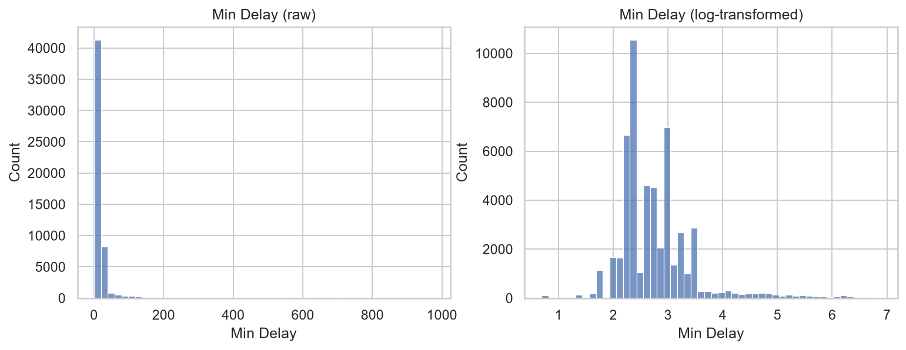
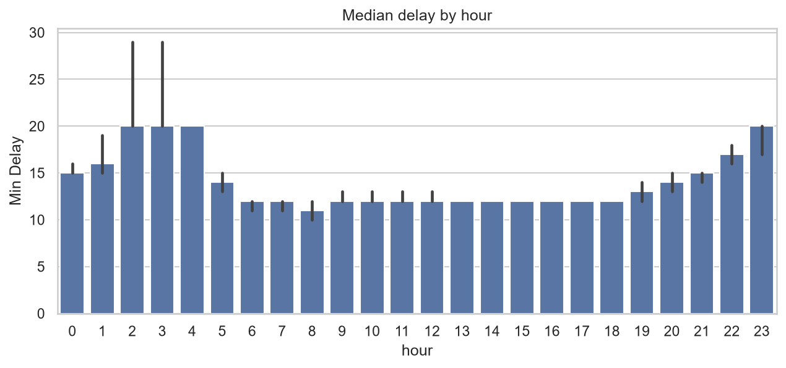
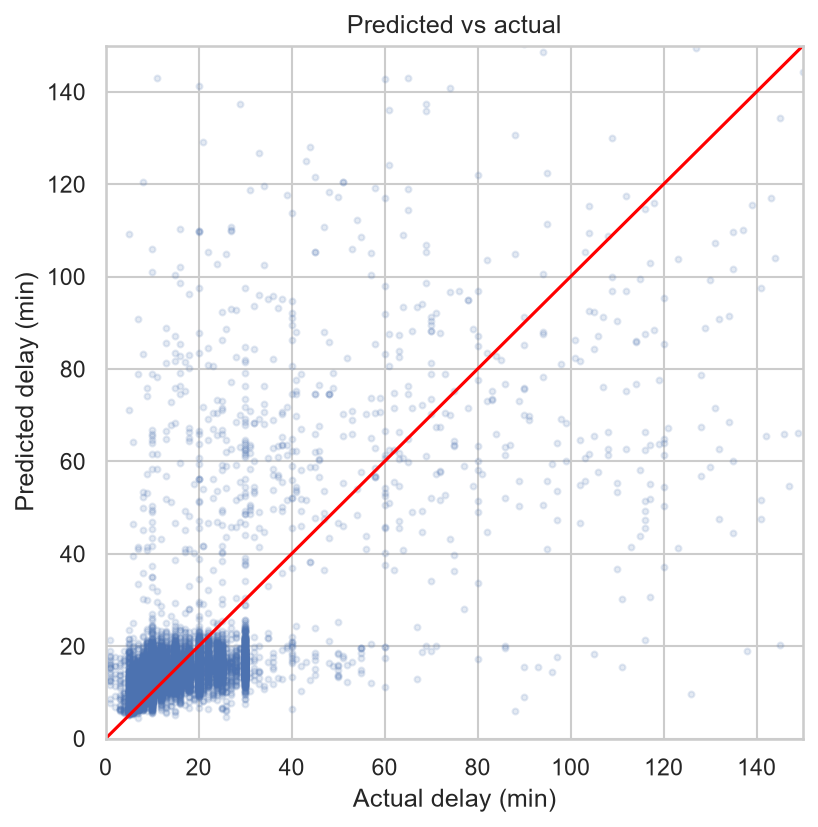

# 🚌 Does Weather Make TTC Bus Delays Last Longer?

**I expected snow and rain to be the villains. The data disagreed.**

A regression project on 52,815 real Toronto bus delays, joined with hourly weather from an API, built to answer one question: *once a bus is delayed, what decides how long the delay lasts?*

---

## ⚡ The 30-second version

| | |
|---|---|
| **Question** | Does weather affect how long a TTC bus delay lasts? |
| **Data** | TTC Bus Delay Data 2024 + Open-Meteo hourly weather |
| **Model** | Random forest predicting `log(1 + delay minutes)` |
| **Best score** | MAE 11.5 min vs. 14.9 min for a "guess the median" baseline |
| **Plot twist** | Weather looked useful at first. It was **leakage**. |
| **Real answer** | Incident type, route, and time of day matter. Weather doesn't. |

---

## 🕵️ The story

### Chapter 1: The data only shows the bad days
The TTC dataset records **only trips that were delayed**. There are no on-time trips in it. So "will my bus be late?" can't be answered from this data. I reframed the problem:

> **Given that a delay happens, how long will it last?**

Knowing what your data can and can't answer is half the job.

### Chapter 2: A very skewed target
Most delays are short (median 12 min), but a few last hours (the longest is 975 min). A model trained on raw minutes would chase those extremes, so I predicted `log(1 + minutes)` and converted back afterward.



### Chapter 3: The night shift is slower
Daytime delays sit at a steady 12-minute median. Between 10 PM and 4 AM, the median rises to 15-20 minutes.



### Chapter 4: The models
Everything is judged against a baseline that always predicts the typical delay.

| Model | MAE (min) | R² (log scale) |
|---|---|---|
| Baseline (always the median) | 14.91 | -0.084 |
| Linear regression | 12.65 | 0.473 |
| **Random forest** | **11.47** | **0.528** |

The random forest cuts the average miss by about 23% versus the baseline.

### Chapter 5: The plot twist
Feature importance ranked temperature and wind as the #2 and #3 features. It looked like weather mattered. I didn't trust it, for two reasons:

1. Random forest importance favors continuous features like temperature.
2. Many delays happen within the same hour, so they share identical weather values. A random train/test split lets the model *recognize the hour* instead of learning a weather effect.

So I ran an ablation (remove all weather columns and compare), then repeated it with a **time-based split** (train Jan-Sep, test Oct-Dec) to remove the leakage.

| Setup | With weather (MAE / R²) | Without weather (MAE / R²) |
|---|---|---|
| Random split | 11.47 / 0.528 | 11.75 / 0.521 |
| **Time-based split** | **11.68 / 0.484** | **11.72 / 0.489** |

The weather "benefit" shrank from 0.28 minutes to 0.04 minutes, about 2 seconds. Once leakage was removed, weather gave **no measurable improvement**.

### Chapter 6: What actually drives delay length
Permutation importance on the test set tells the real story:

1. **`Incident_Diversion`** by a huge margin (diversions have a median delay of 70 min, versus 12 for most other incident types)
2. Route group
3. Hour of day and night-time
4. Weather, far behind



The model is tight for everyday delays (5-30 min) and underpredicts the rare long ones.

---

## 🎯 Try the predictor

```python
predict_delay(route="36", incident="Mechanical", hour=8, day_of_week=1)   # -> 6.7 min
predict_delay(route="36", incident="Diversion",  hour=8, day_of_week=1)   # -> 65.1 min
predict_delay(route="999", incident="Mechanical", hour=8, day_of_week=1)  # unknown route -> 11.2 min
```

I sanity-checked it against the raw data: route 36 mechanical delays really do have a median of 6 minutes, well below the network-wide 12.

---

## ⚠️ Honest limitations

- **Delays only.** Weather may change *how often* delays happen, but this dataset can't show that.
- **The predictor needs the incident type as input.** A commuter doesn't know that in advance, so this answers "if X happens, how long?", not "will my bus be late?".
- **Long delays are underpredicted.** The model is much better at typical delays than at extremes.
- **One year, one city, one time-based split.** The with/without-weather difference is too small to claim weather hurts, only that it doesn't help.
- **Top 30 routes are modeled individually.** The other 210 routes share an "Other" group (about half of all rows).

---

## 🔭 What I'd do next

- Add 2022-2023 data for more seasons and a stronger time-based test
- Flip the question: predict **how many delays occur per hour** from weather, which is where weather effects would actually show up
- Try gradient boosting and compare

---

## 🧰 Tech stack

Python · pandas · NumPy · Requests · scikit-learn · Seaborn · Matplotlib

## 📁 Project structure

```
├── data/
│   └── weather_2024.csv          # pulled from Open-Meteo via requests
├── images/                       # plots used in this README
├── notebooks/                    # run in numeric order
└── requirements.txt
```

## 🚀 Run it yourself

```bash
git clone https://github.com/YOUR-USERNAME/ttc-bus-delay-predictor.git
cd ttc-bus-delay-predictor
pip install -r requirements.txt
```

1. Download **TTC Bus Delay Data 2024** (`.xlsx`) from the [City of Toronto Open Data portal](https://open.toronto.ca) and place it in `data/`.
2. Run the notebooks in `notebooks/` in numeric order.

## 📚 Data sources

- **TTC Bus Delay Data 2024**: City of Toronto Open Data
- **Historical hourly weather** (temperature, precipitation, rain, snowfall, wind): [Open-Meteo Archive API](https://open-meteo.com)

---

*Built as a portfolio project on time-based feature engineering, API data joins, and honest model validation.*
